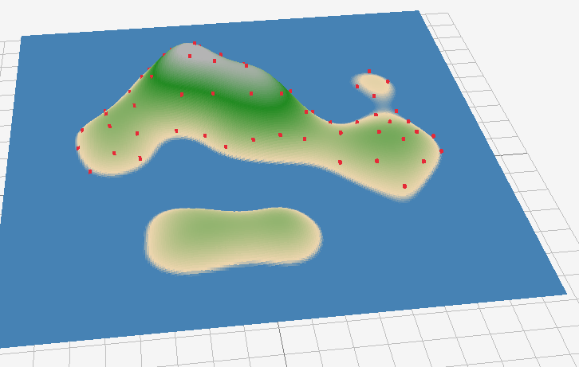
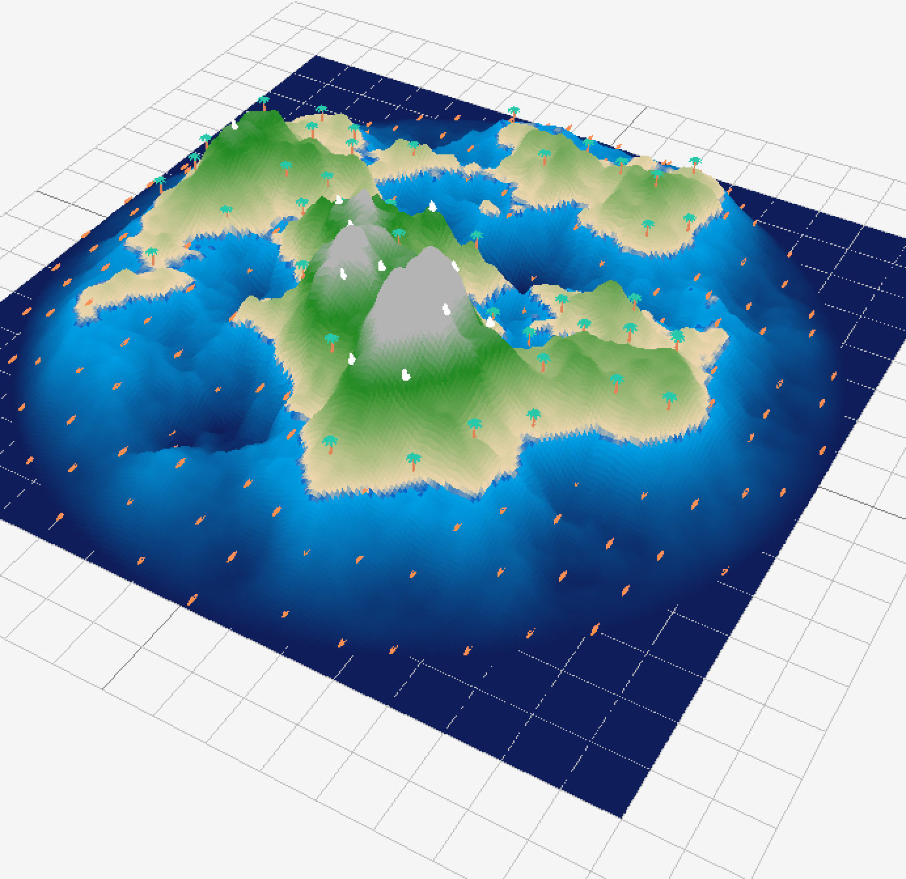
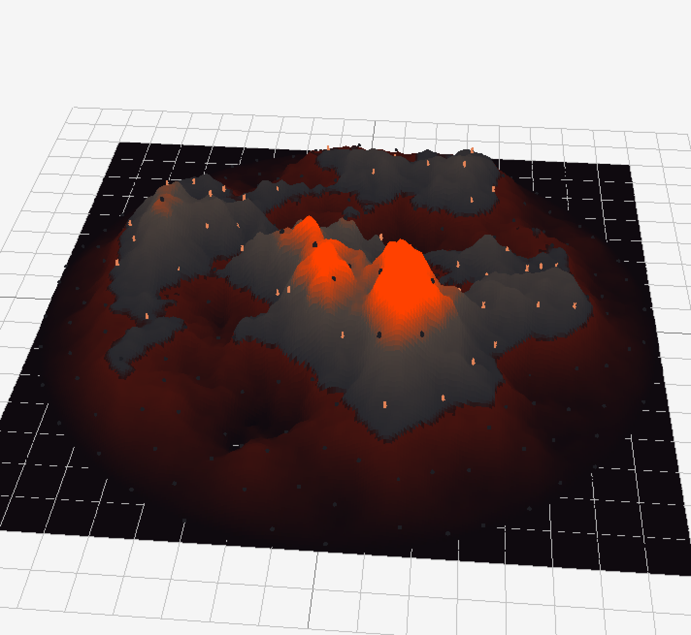
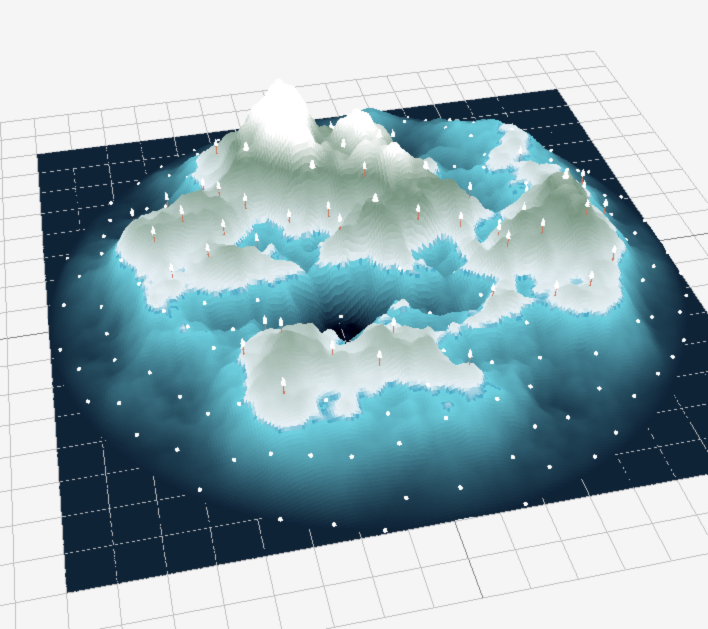
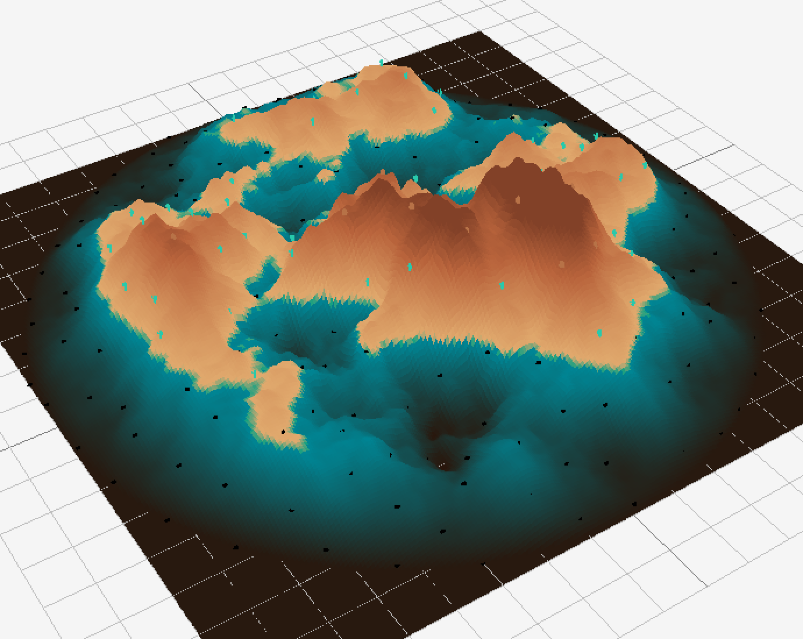

# IslandViewerStudents

Rapport — Island Viewer

Le code a été réalisé dans le langage C++ sous les plateformes Windows et macOS.

## 1. Les choix algorithmiques

### a. Bruit fractal
Le bruit de base utilisé est le bruit de Perlin, via la fonction `glm::perlin()` de la bibliothèque GLM. Bien que plus lisse que le bruit de valeur simple, le Perlin seul manque de détail. Pour y remédier, nous avons implémenté un FBM (Fractional Brownian Motion), aussi appelé bruit fractal.

**Paramètres retenus et impact visuel :**

* **Octaves (1–8) :** Chaque octave ajoute un niveau de détail.
  * *1 octave :* Le terrain est très lisse et générique. 
  * *5–6 octaves :* On obtient des reliefs naturels avec côtes dentelées et collines internes. [octave 5](image-3.png)
  * *Au-delà de 7 :* Le terrain devient excessivement bruité. [octave 8](image-4.png)

* **Lacunarité (1–4) :** Contrôle l'écart de fréquence entre octaves.
  * À `2.0`, chaque octave est deux fois plus fine. Des valeurs proches de `1.0` donnent un terrain très doux et homogène.  

* **Gain (0.0–1.0) :** Facteur multiplicateur de l'amplitude pour chaque octave.
  * `0.5` signifie que l'amplitude de chaque octave est réduite de moitié par rapport à la précédente. 
  * Un gain élevé (`> 0.7`) rend les détails fins aussi importants que la forme générale, créant un terrain très chaotique. 

* **Scale (0.01–10.0) :** Facteur d'échelle pour contrôler la "taille" du bruit généré.
  * Une grande valeur agrandit les détails. 
  * Une petite valeur étale le relief. 

### b. Génération de heightmap et couleurs
La heightmap est générée dans un format float 32 bits par pixel (`PIXELFORMAT_UNCOMPRESSED_R32`). Sur l'image, la valeur de chaque pixel représente une altitude, ce qui évite toute perte de précision lors de la génération du mesh.

Chaque pixel est calculé par la fonction suivante :
1. **Calcul du bruit FBM :** Génère des formes aléatoires naturelles (comme des montagnes ou des nuages) avec une valeur comprise dans l'intervalle `[0, 1]`.
2. **Application du masque radial (island mask) :** Plus on s'éloigne du centre, plus on force l'altitude à descendre vers 0. Cela garantit que les bords de la carte sont sous l'eau.
3. **Clamp au waterLevel :** Toute valeur en dessous du niveau d'eau est forcée à `waterLevel`, aplatissant ainsi le fond marin.

**La mise en couleur (Coloration par palier) :**
La conversion heightmap → couleur utilise un système de zones avec une interpolation linéaire (`glm::mix`) entre les paliers, évitant les transitions brusques :
* `v < 0.28` : Eau profonde (bleu acier, 70/130/180).
* `0.28–0.30` : Transition eau → sable (2% de la plage de hauteur seulement), créant une plage étroite et réaliste.
* `0.30–0.55` : Transition sable → herbe, la zone la plus large correspondant aux plaines côtières et aux collines basses.
* `v > 0.55` : Transition herbe → roche claire, représentant les hauteurs et sommets.

L'utilisation de `glm::mix()` plutôt que de couleurs solides par palier donne un aspect naturel en évitant les contours artificiels entre biomes.

### c. Distribution de points par Poisson disk sampling
Cet algorithme génère des points aléatoires avec une contrainte : deux points ne peuvent jamais être plus proches que la distance `r`. L'idée principale repose sur une liste active de points "candidats" qui génèrent des voisins, et sur une grille d'accélération pour tester rapidement les collisions.

Les 4 étapes du code en résumé :
* **Grille d'accélération ($cellSize = r / \sqrt{2}$)** : Chaque cellule ne contient qu'un seul point au maximum, donc chercher des voisins se réduit à regarder les 25 cellules autour (matrice 5×5).
* **Point de départ** : Tirage aléatoire jusqu'à trouver un point valide via le filtre `isOnIsland()`.
* **Filtrage sur l'île** : Un filtre `isOnIsland()` rejette tout candidat dont la hauteur dans la heightmap est inférieure au `waterLevel`. Le point de départ est lui-même cherché par tirage aléatoire avec jusqu'à 10 000 tentatives. Les points sont ainsi automatiquement contraints à la surface terrestre, sans post-traitement.
* **Boucle principale** : Un point actif génère `k` candidats dans l'anneau `[r, 2r]`. Si le candidat est sur l'île et assez loin de tous ses voisins, il est ajouté. Sinon, il est ignoré. Si aucun candidat ne passe après `k` essais, le point est retiré de la liste active.
  * *maxAttempts (k) :* Nombre de candidats testés autour de chaque point actif avant de le retirer de la liste active. La valeur standard `k=30` est un bon compromis entre qualité de remplissage et temps de calcul.
  * *minDistance (r) :* Détermine la densité maximale. Une valeur faible produit des centaines d'arbres très proches ; une valeur grande donne une distribution clairsemée.
* **Fin** : Quand la liste active est vide, le terrain est saturé.

Les points doivent être réinitialisés à chaque fois que l'on change un paramètre, sinon les points générés ne s'adaptent pas correctement au relief visualisé, comme sur cet exemple lorsque l'on augmente le scale :

### d. Placement des objets sur le terrain et filtrage par hauteur
Une fois les points 2D générés par l'algorithme de Poisson Disk Sampling, ils sont projetés en 3D sur la surface de l'île en échantillonnant directement les données de hauteur de la heightmap.

Pour obtenir un rendu réaliste et cohérent avec l'écosystème de l'île, nous avons implémenté un système de filtrage par paliers d'altitude :
* **Interdiction stricte dans l'eau :** Tout point dont l'altitude est inférieure ou égale au niveau de l'eau ($v \le \text{waterLevel}$) est immédiatement rejeté pour éviter que des objets ou des structures ne soient immergés ou ne flottent de manière anormale dans l'océan (ex: pas d'arbres dans la mer).
* **Distribution thématique (Plaines vs Hauteurs) :** Le script de placement utilise des seuils d'altitude pour distribuer les modèles de manière logique. Les éléments de flore classiques (arbres, cactus) apparaissent uniquement dans les plaines stables, tandis que les structures spécifiques ou les formations rocheuses massives sont réservées aux zones de haute montagne.

---

## 2. Améliorations intégrées au projet

 

Nous avons enrichi l'application initiale avec deux fonctionnalités majeures afin d'apporter de la modularité et d'améliorer l'aspect visuel globale :

### a. Système de palettes de couleurs dynamiques
Au lieu de figer l'île dans un unique thème verdoyant, nous avons lié la coloration par palier (gérée via `glm::mix`) à un système de palettes interchangeables. Lors du changement de thème dans l'interface ImGui, les couleurs cibles des transitions (eau profonde, plage, plaine, roche) sont instantanément mises à jour, permettant de passer d'un lagon tropical à une mer de lave ou à une banquise polaire en un clic.

### b. Biomes et modèles 3D dynamiques (Les 4 Îles)
L'affichage des objets s'adapte désormais en temps réel au thème sélectionné grâce à un tableau de configurations dans notre contexte (`context.biomeModels`, `context.waterModels`, `context.mountainModels`). L'utilisateur peut explorer 4 ambiances uniques :
* **Tropical :** Palmiers au centre, canoës sur l'eau, rochers classiques sur les sommets.
* **Volcanic :** Arbres calcinés, débris magmatiques sur l'eau (lave), pics rocheux sombres.
* **Arctic :** Sapins enneigés (`tree_pineTallA_detailed`), blocs de glace/icebergs flottants (`stone_smallI_white`), tentes de camp de base sur les sommets.
* **Desert :** Grands cactus (`cactus_tall`), dalles de pierre craquelées sur le sable (`stone_smallFlatC`), et grandes buttes de canyon ocre.

---

## 3. Difficultés rencontrées et solutions

* **Le piège de la mémoire du Disk Sampling lors des changements de paramètres :**
  * *Problème :* Lors de la modification dynamique du *scale* ou du relief via les sliders ImGui, les anciens points restaient figés sur leurs coordonnées ou ne se repositionnaient pas correctement par rapport à la nouvelle topologie, brisant la cohérence visuelle.
  * *Solution :* Nous avons forcé une réinitialisation et une régénération complète de la liste des points à chaque fois qu'un paramètre de bruit ou de géométrie est modifié dans l'interface.
* **Le bug des fichiers `.mtl` "aveugles" (Modèles devenant blancs ou noirs) :**
  * *Problème :* Lors de la personnalisation des couleurs pour le biome désert et arctique, les fichiers `.obj` de Kenney ne trouvaient plus leurs couleurs personnalisées et s'affichaient en blanc brut, ou viraient au noir complet à cause d'erreurs de parsing de Raylib.
  * *Solution :* Nous avons compris que le format `.obj` embarque en dur le nom du fichier matériel recherché (`mtllib stone.mtl`). Nous avons corrigé l'en-tête interne des fichiers `.obj` pour pointer précisément vers nos nouveaux fichiers matériels, et nettoyé les espaces ou encodages invisibles à la fin des fichiers `.mtl` pour que Raylib applique correctement les vecteurs de couleur $K_d$ (ex: `Kd 0.72 0.45 0.28` pour le marron aride).

---

## 4. Post-Mortem

### Qu'est-ce qui a bien fonctionné ?
La génération procédurale globale s'avère extrêmement fluide. Le couplage entre le bruit FBM de GLM pour la heightmap et l'algorithme de Poisson Disk Sampling permet de générer des mondes uniques, optimisés (grâce à la grille en $5 \times 5$) et visuellement très satisfaisants. L'implémentation de la coloration par interpolation linéaire (`glm::mix`) donne un aspect professionnel aux transitions de terrain.

### Problèmes rencontrés et gestion
Le principal défi a été la gestion des formats de fichiers 3D low-poly et leur intégration avec Raylib. Travailler directement dans les fichiers bruts (`.obj` et `.mtl`) nous a forcées à comprendre rigoureusement comment un moteur de rendu lie une géométrie à ses propriétés de surface. Les bugs visuels ont été surmontés.

### Avec plus de temps, qu'est-ce qu'on pourrait ajouter ?
* **Variations d'échelle et rotations aléatoires :** Appliquer un facteur de transformation aléatoire (échelle et angle) sur chaque arbre/rocher lors du rendu pour casser l'effet de répétition des assets 3D de Kenney.
* **Météo dynamique :** Ajouter un système de particules pour simuler de la neige sur l'île Arctic et des cendres tombantes sur l'île Volcanic.

### Répartition du travail dans le groupe
Le travail a été distribué de manière équitable :
* **Yasmine :** Développement de la question 1 et 3.
* **Mila :** Développement de la question 2, 4, et améliorations.
